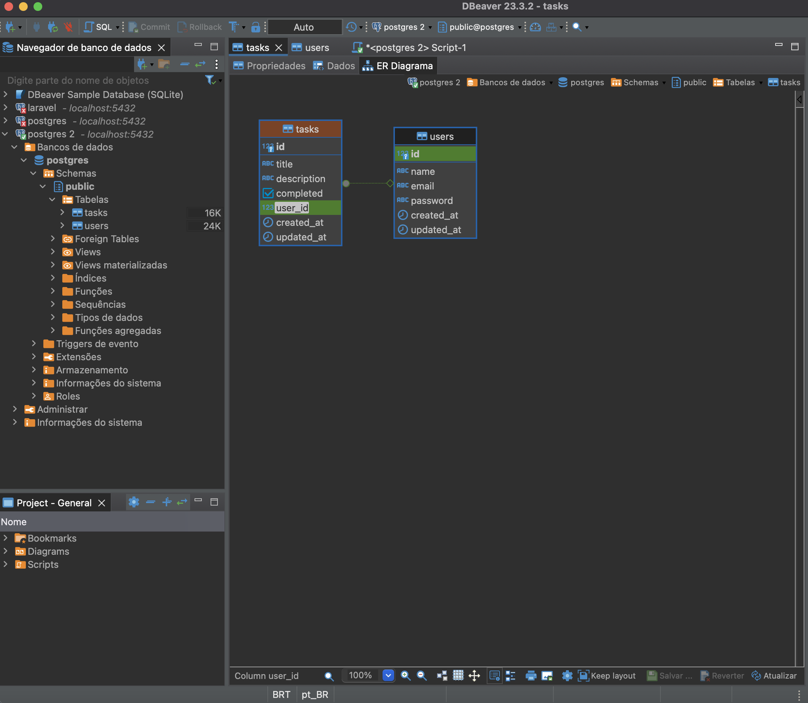
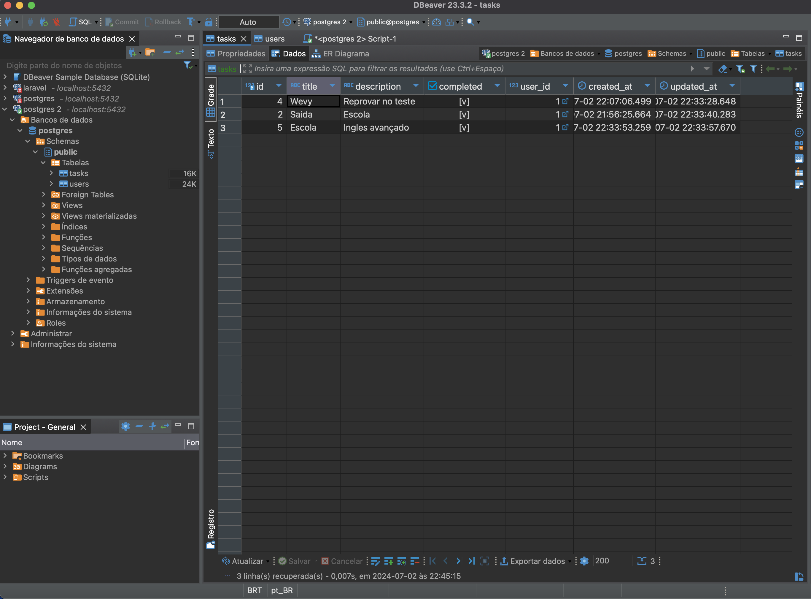
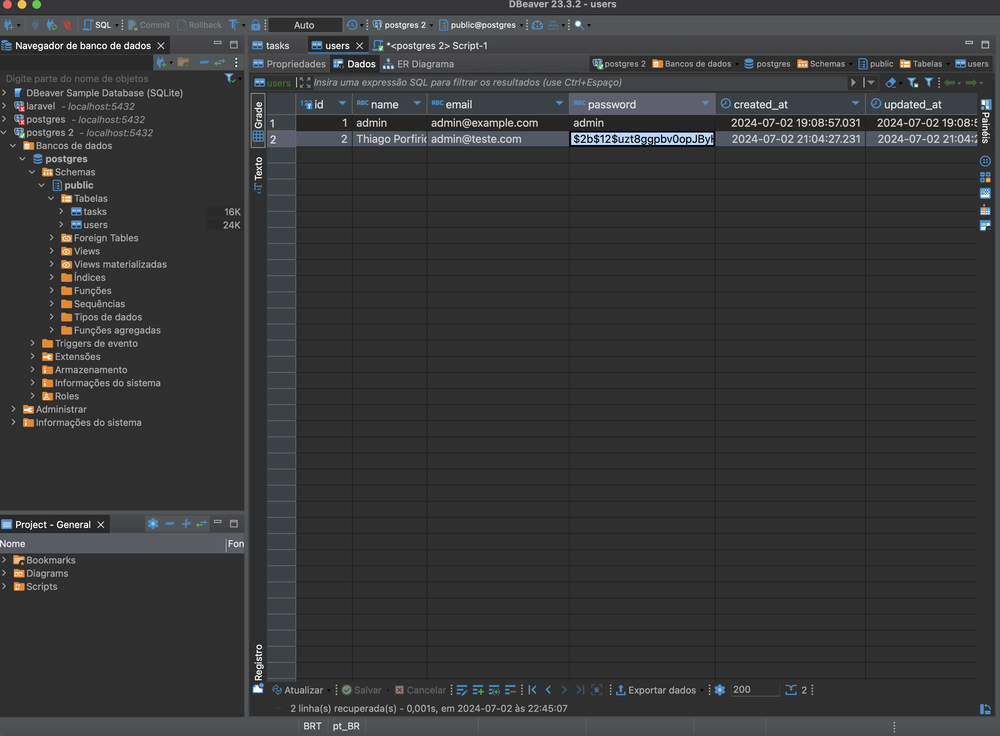

# To-Do List Application

## Descrição

Esta é uma aplicação de lista de tarefas (To-Do List) construída com React, TypeScript, Zustand para gerenciamento de estado, e Material-UI para os componentes de interface do usuário. A aplicação utiliza um backend em Node.js com Express e TypeORM para interação com um banco de dados PostgreSQL.

## Funcionalidades

- Autenticação de usuário (Login).
- CRUD de tarefas (Criação, Leitura, Atualização, Exclusão).
- Persistência de dados no banco de dados PostgreSQL.
- Interface de usuário estilizada com Material-UI.
- Gerenciamento de estado com Zustand.

  ## Estrutura do Banco de Dados







## Demonstração

Veja a demonstração da aplicação no seguinte vídeo:

[](https://youtu.be/jVo5BsHSUgE)


## Requisitos

- Node.js
- Yarn
- PostgreSQL
- Docker (opcional, para facilitar a configuração do banco de dados)

## Instalação

### Backend

1. Clone o repositório:

    ```sh
    git clone <url-do-repositorio>
    cd <nome-do-repositorio>
    ```

2. Navegue até o diretório `backend` e instale as dependências:

    ```sh
    cd backend
    yarn install
    ```

3. Configure o banco de dados PostgreSQL. Você pode usar Docker para criar um contêiner PostgreSQL:

    ```sh
    docker run --name wevy -e POSTGRES_PASSWORD=password -d -p 5432:5432 postgres
    ```

4. Crie um arquivo `.env` com as seguintes variáveis de ambiente:

    ```sh
    TYPEORM_CONNECTION = postgres
    TYPEORM_HOST = localhost
    TYPEORM_USERNAME = postgres
    TYPEORM_PASSWORD = password
    TYPEORM_DATABASE = wevy
    TYPEORM_PORT = 5432
    TYPEORM_SYNCHRONIZE = true
    TYPEORM_LOGGING = false
    TYPEORM_ENTITIES = src/entity/**/*.ts
    TYPEORM_MIGRATIONS = src/migration/**/*.ts
    TYPEORM_SUBSCRIBERS = src/subscriber/**/*.ts
    TYPEORM_JWT_SECRET = your_jwt_secret
    ```

5. Execute as migrações para criar as tabelas no banco de dados:

    ```sh
    yarn typeorm migration:run
    ```

6. Inicie o servidor backend:

    ```sh
    yarn start
    ```

### Frontend

1. Navegue até o diretório `frontend` e instale as dependências:

    ```sh
    cd ../frontend
    yarn install
    ```

2. Crie um arquivo `.env` com a seguinte variável de ambiente:

    ```sh
    VITE_API_URL=http://localhost:443
    ```

3. Inicie o servidor de desenvolvimento do frontend:

    ```sh
    yarn dev
    ```

## Estrutura do Projeto

### Backend

- `src/entity`: Contém as entidades do TypeORM (User e Task).
- `src/controller`: Contém os controladores para as rotas de autenticação e tarefas.
- `src/database`: Configuração do TypeORM.
- `src/migration`: Contém as migrações do banco de dados.

### Frontend

- `src/pages`: Contém as páginas principais da aplicação (LoginPage e TaskPage).
- `src/components`: Contém componentes reutilizáveis (PrivateRoute).
- `src/store`: Contém a configuração do Zustand para gerenciamento de estado.
- `src/theme`: Configuração do tema do Material-UI.

## API

### Autenticação

- `POST /login`
  - **Descrição**: Autentica um usuário e retorna um token JWT.
  - **Corpo da Requisição**: `{ "email": "string", "password": "string" }`
  - **Resposta**: `{ "token": "string" }`

### Tarefas

- `POST /create-task`
  - **Descrição**: Cria uma nova tarefa.
  - **Corpo da Requisição**: `{ "title": "string", "description": "string", "completed": "boolean" }`
  - **Resposta**: `{ "id": "number", "title": "string", "description": "string", "completed": "boolean", "user": { "id": "number", "name": "string", "email": "string" }, "created_at": "date", "updated_at": "date" }`

- `GET /get-tasks`
  - **Descrição**: Retorna todas as tarefas do usuário autenticado.
  - **Resposta**: `[{ "id": "number", "title": "string", "description": "string", "completed": "boolean", "user": { "id": "number", "name": "string", "email": "string" }, "created_at": "date", "updated_at": "date" }]`

- `PUT /update-task/:id`
  - **Descrição**: Atualiza uma tarefa existente.
  - **Parâmetros**: `id` (ID da tarefa)
  - **Corpo da Requisição**: `{ "title": "string", "description": "string", "completed": "boolean" }`
  - **Resposta**: `{ "id": "number", "title": "string", "description": "string", "completed": "boolean", "user": { "id": "number", "name": "string", "email": "string" }, "created_at": "date", "updated_at": "date" }`

- `DELETE /delete-task/:id`
  - **Descrição**: Deleta uma tarefa existente.
  - **Parâmetros**: `id` (ID da tarefa)
  - **Resposta**: `{ "message": "Tarefa deletada com sucesso" }`

## Testes

### Backend

1. Navegue até o diretório `backend` e execute os testes:

    ```sh
    yarn test
    ```

### Frontend

1. Navegue até o diretório `frontend` e execute os testes:

    ```sh
    yarn test
    ```

## Contribuição

1. Faça um fork do projeto.
2. Crie uma branch para sua feature (`git checkout -b feature/nova-feature`).
3. Faça commit das suas alterações (`git commit -m 'Adiciona nova feature'`).
4. Faça push para a branch (`git push origin feature/nova-feature`).
5. Abra um Pull Request.

## Licença

Este projeto está licenciado sob a licença MIT - veja o arquivo [LICENSE](LICENSE) para mais detalhes.
